<div align="center">
  
</div>

<br />

<div align="center">
  <a href="https://github.com/ANDY0802X"></a>
  <a href="https://www.linkedin.com/in/aayush-kumawat-80466538b/"></a>
  <a href="https://instagram.com/its_aayush_kumawat"></a>
</div>

## `> system.readme`

```text
NAME       Aayush Kumawat
ROLE       Student Developer • Full Stack • UI/UX • Web • Game Dev
LOCATION   Jaipur, Rajasthan
STATUS     Currently building small worlds with large ideas
SIGNAL     A machine that turns coffee into code.
```

> This repository is the source for my GitHub profile dashboard. The SVG is generated from public GitHub API data, so the numbers, repository cards, activity stream, and contribution visualization stay fresh without relying on fragile third-party profile widgets.

### ⚡ Currently Building

- **Interactive web experiences** with React, Node.js, Firebase, Supabase, and MongoDB.
- **Game worlds and atmospheric interfaces** inspired by `The-Backrooms` and `Stiki-war`.
- **Useful experiments** that turn rough ideas into polished, shippable interfaces.

### 🧰 Developer Setup

`VS Code` · `Spyder IDE` · `Eclipse` · `Figma` · `Stitch` · `Terminal` · `Antigravity` · `Base44` · `Claude` · `OpenClaw` · `Ollama`

### 🧪 Technology Ecosystem

| Layer | Stack |
| --- | --- |
| Languages | Java · Python · C++ · JavaScript · HTML · CSS |
| Frontend | React · responsive UI · SVG motion · glassmorphism |
| Backend | Node.js · Firebase · Supabase |
| Data | MongoDB · MySQL |
| Craft | Git · Figma · Stitch · terminal-first workflows |

### 🎮 Gaming

Atmospheric games, strange spaces, survival systems, and anything that makes a UI feel like a place rather than a page.

### 🎵 Coding Music

Instrumental / lofi mode: **on**. The optional Spotify workflow can update the recently played panel when `SPOTIFY_CLIENT_ID`, `SPOTIFY_CLIENT_SECRET`, and `SPOTIFY_REFRESH_TOKEN` are configured. Without secrets, the dashboard keeps a calm local fallback instead of breaking.

### 🏆 Certifications

`[ certification slot ]` · `[ certification slot ]` · `[ certification slot ]`

### 🧩 Easter Eggs

- The dashboard palette shifts toward amber when the activity stream detects a high-output streak.
- Repository cards use the language palette from the actual project rather than a generic badge.
- The tiny status line is intentionally written like a terminal prompt: ideas in, interfaces out.

### 🌐 Find Me

| Network | Link |
| --- | --- |
| GitHub | [@ANDY0802X](https://github.com/ANDY0802X) |
| Instagram | [@its_aayush_kumawat](https://instagram.com/its_aayush_kumawat) |
| LinkedIn | [aayush-kumawat-80466538b](https://www.linkedin.com/in/aayush-kumawat-80466538b/) |
| Portfolio | `coming soon` |
| Email | GitHub account email is not publicly exposed; add it to `scripts/profile_config.json` if you want it displayed |
| Holopin | [badges](https://holopin.io/@andy0802x) |

### 🧭 Developer Philosophy

> Make it useful. Make it feel alive. Make the next version easier to build.

---

<div align="center">
  <sub>Generated with public GitHub data · designed as an original Nothing-OS-inspired developer console · profile picture intentionally preserved via GitHub avatar URL</sub>
</div>
